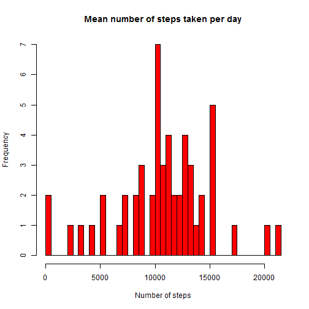
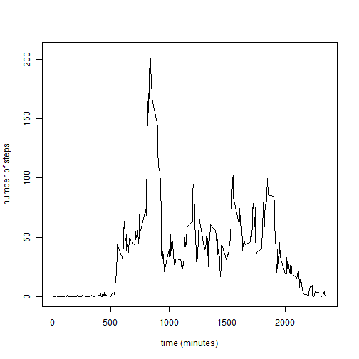
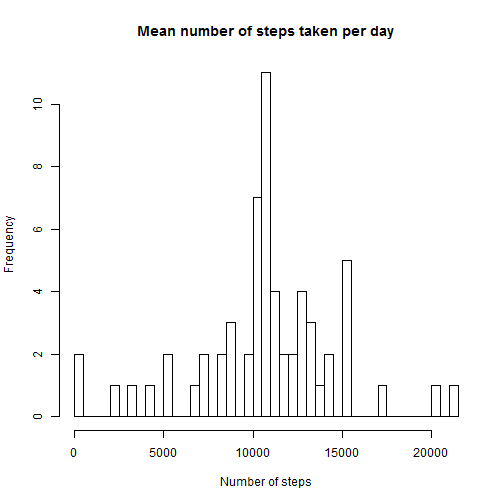
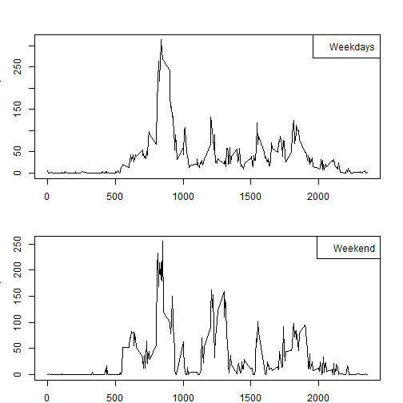

This is an R Markdown document made in fulfilment of assignment 1 of the Coursera course 'Reproducible research'.  

Markdown is a simple formatting syntax for authoring HTML, PDF, and MS Word documents. For more details on using R Markdown see 
<http://rmarkdown.rstudio.com>.  
Information about assignment 1 can be found on:
<https://class.coursera.org/repdata-032/human_grading/view/courses/975145/assessments/3/submissions>  

Assignment 1 deals with data about the personal movement gathered using personal activity monitoring devices. On the website of this course is written about the data collection process:
'This device collects data at
5 minute intervals through out the day. The data consists of two months of data from an anonymous
individual collected during the months of October and November, 2012 and include the number of steps
taken in 5 minute intervals each day.'  

Libraries used in this calculation


```r
  library(graphics)
  library(grDevices)
  library(dplyr)
```

```
## 
## Attaching package: 'dplyr'
## 
## The following objects are masked from 'package:stats':
## 
##     filter, lag
## 
## The following objects are masked from 'package:base':
## 
##     intersect, setdiff, setequal, union
```
The data for this analysis is obtained from:
<https://d396qusza40orc.cloudfront.net/repdata%2Fdata%2Factivity.zip> [52K]
The variables included in this dataset are:

** steps: Number of steps taking in a 5-minute interval (missing values are coded as NA)

** date: The date on which the measurement was taken in YYYY-MM-DD format

** interval: Identifier for the 5-minute interval in which measurement was taken

First the data is read from the input file and stored in the dataframe AllData. Next the data is made suitable for processing, i.e. the data with NA is removed and the cleaned data is stored in the dataframe selectData:

```r
  AllData <- read.csv("activity.csv")

  good_D<-!is.na(AllData$steps)  
  AllData_labeled<-cbind(AllData,good_D)

  selectData<-filter(AllData_labeled,good_D==TRUE)
```

A histogram of the average number steps taken per day:


```r
 number_of_steps<-tapply(selectData$steps,INDEX=selectData$date,FUN=sum)
 hist(number_of_steps,nclass=dim(number_of_steps), 
      main="Mean number of steps taken per day",
      xlab="Number of steps",ylab="Frequency",col="red")
```

 

```r
## plot(hist(number_of_steps), main="Number of steps",
##   xlab="Number of steps",ylab="Day")
```

Calculation of the mean number of steps per day


```r
mean_steps<-tapply(selectData$steps,INDEX=selectData$date,FUN=mean,simplify=TRUE)
print(mean_steps)
```

```
##  10/1/2012 10/10/2012 10/11/2012 10/12/2012 10/13/2012 10/14/2012 
##         NA 34.3750000 35.7777778 60.3541667 43.1458333 52.4236111 
## 10/15/2012 10/16/2012 10/17/2012 10/18/2012 10/19/2012  10/2/2012 
## 35.2048611 52.3750000 46.7083333 34.9166667 41.0729167  0.4375000 
## 10/20/2012 10/21/2012 10/22/2012 10/23/2012 10/24/2012 10/25/2012 
## 36.0937500 30.6284722 46.7361111 30.9652778 29.0104167  8.6527778 
## 10/26/2012 10/27/2012 10/28/2012 10/29/2012  10/3/2012 10/30/2012 
## 23.5347222 35.1354167 39.7847222 17.4236111 39.4166667 34.0937500 
## 10/31/2012  10/4/2012  10/5/2012  10/6/2012  10/7/2012  10/8/2012 
## 53.5208333 42.0694444 46.1597222 53.5416667 38.2465278         NA 
##  10/9/2012  11/1/2012 11/10/2012 11/11/2012 11/12/2012 11/13/2012 
## 44.4826389         NA         NA 43.7777778 37.3784722 25.4722222 
## 11/14/2012 11/15/2012 11/16/2012 11/17/2012 11/18/2012 11/19/2012 
##         NA  0.1423611 18.8923611 49.7881944 52.4652778 30.6979167 
##  11/2/2012 11/20/2012 11/21/2012 11/22/2012 11/23/2012 11/24/2012 
## 36.8055556 15.5277778 44.3993056 70.9270833 73.5902778 50.2708333 
## 11/25/2012 11/26/2012 11/27/2012 11/28/2012 11/29/2012  11/3/2012 
## 41.0902778 38.7569444 47.3819444 35.3576389 24.4687500 36.7048611 
## 11/30/2012  11/4/2012  11/5/2012  11/6/2012  11/7/2012  11/8/2012 
##         NA         NA 36.2465278 28.9375000 44.7326389 11.1770833 
##  11/9/2012 
##         NA
```
The median of the number of steps taken per day:

```r
median_steps<-tapply(selectData$steps,INDEX=selectData$date,FUN=median,
                     simplify=TRUE)
print(median_steps)
```

```
##  10/1/2012 10/10/2012 10/11/2012 10/12/2012 10/13/2012 10/14/2012 
##         NA          0          0          0          0          0 
## 10/15/2012 10/16/2012 10/17/2012 10/18/2012 10/19/2012  10/2/2012 
##          0          0          0          0          0          0 
## 10/20/2012 10/21/2012 10/22/2012 10/23/2012 10/24/2012 10/25/2012 
##          0          0          0          0          0          0 
## 10/26/2012 10/27/2012 10/28/2012 10/29/2012  10/3/2012 10/30/2012 
##          0          0          0          0          0          0 
## 10/31/2012  10/4/2012  10/5/2012  10/6/2012  10/7/2012  10/8/2012 
##          0          0          0          0          0         NA 
##  10/9/2012  11/1/2012 11/10/2012 11/11/2012 11/12/2012 11/13/2012 
##          0         NA         NA          0          0          0 
## 11/14/2012 11/15/2012 11/16/2012 11/17/2012 11/18/2012 11/19/2012 
##         NA          0          0          0          0          0 
##  11/2/2012 11/20/2012 11/21/2012 11/22/2012 11/23/2012 11/24/2012 
##          0          0          0          0          0          0 
## 11/25/2012 11/26/2012 11/27/2012 11/28/2012 11/29/2012  11/3/2012 
##          0          0          0          0          0          0 
## 11/30/2012  11/4/2012  11/5/2012  11/6/2012  11/7/2012  11/8/2012 
##         NA         NA          0          0          0          0 
##  11/9/2012 
##         NA
```
The construction of a time series plot of the mean number of steps

```r
avSteps_interval<-tapply(selectData$steps,INDEX=selectData$interval,FUN=mean,
                         simplify=FALSE)
time_coord<-as.numeric(rownames(avSteps_interval))

plot(x=time_coord,y=avSteps_interval,type="l",
          xlab="time (minutes)",ylab="number of steps")  
```

 

The highest number of steps in this time series is


```r
maxSteps<-max(as.numeric(avSteps_interval))
maxSteps_Boolean<-maxSteps==as.numeric(avSteps_interval)
print((as.numeric(avSteps_interval[maxSteps_Boolean==TRUE])))
```

```
## [1] 206.1698
```
This occured on time (minutes):

```r
print(time_coord[maxSteps_Boolean==TRUE])
```

```
## [1] 835
```
The number of lines in the data file with missing values (i.e.NA) is given by:

```r
Rows_NA<-complete.cases(AllData)
numbRows_NA<- sum(Rows_NA)
print(sum(!Rows_NA))
```

```
## [1] 2304
```
Next all elements with missing values are replaced by the average values for that specific time interval. All missing values are found to be in the steps-column.
The procedure to replace the missing values, is as follows: 

1) split the AllData into 3 separate vectors (steps,date,interval)  

2) and combine the date- and interval-data in a new dataframe  


```r
steps<-AllData[,1]
date<-AllData[,2]
interval<-AllData[,3]
date_interval<-data.frame(date,interval)
```

3) Locate and replace the NA in the vector steps by the corresponding average value for that time interval. Since the length of the array with the average values is unknown up to this moment, this values has to be determined first. It is stored in avSteps_length.  


```r
dim_AllData<-dim(AllData)
All<-as.numeric(dim_AllData[1])
avSteps_length<-(dim(avSteps_interval))

ilabel<-0
for (i in (1:All)) {
  ilabel<-ilabel+1
  if(ilabel>avSteps_length) {
    ilabel<-ilabel-avSteps_length
  }
  if(is.na(steps[i])==TRUE) {
     steps[i]<-as.numeric(avSteps_interval[ilabel])
  }
  
 }
```

4) The new steps vector is combined with the data frame date_interval:  


```r
AllData_new<-data.frame(steps,date_interval)
```

Using this new set of data a new histrogram is made, relating the average number of steps to the days:

```r
number_of_steps<-tapply(AllData_new$steps,INDEX=AllData_new$date,FUN=sum)

hist(number_of_steps,nclass=dim(number_of_steps), 
      main="Mean number of steps taken per day",
      xlab="Number of steps",ylab="Frequency")
```

 

A new value for the average number of steps:

```r
mean_steps<-tapply(AllData_new$steps,INDEX=AllData_new$date,FUN=mean)
print((mean_steps))
```

```
##  10/1/2012 10/10/2012 10/11/2012 10/12/2012 10/13/2012 10/14/2012 
## 37.3825996 34.3750000 35.7777778 60.3541667 43.1458333 52.4236111 
## 10/15/2012 10/16/2012 10/17/2012 10/18/2012 10/19/2012  10/2/2012 
## 35.2048611 52.3750000 46.7083333 34.9166667 41.0729167  0.4375000 
## 10/20/2012 10/21/2012 10/22/2012 10/23/2012 10/24/2012 10/25/2012 
## 36.0937500 30.6284722 46.7361111 30.9652778 29.0104167  8.6527778 
## 10/26/2012 10/27/2012 10/28/2012 10/29/2012  10/3/2012 10/30/2012 
## 23.5347222 35.1354167 39.7847222 17.4236111 39.4166667 34.0937500 
## 10/31/2012  10/4/2012  10/5/2012  10/6/2012  10/7/2012  10/8/2012 
## 53.5208333 42.0694444 46.1597222 53.5416667 38.2465278 37.3825996 
##  10/9/2012  11/1/2012 11/10/2012 11/11/2012 11/12/2012 11/13/2012 
## 44.4826389 37.3825996 37.3825996 43.7777778 37.3784722 25.4722222 
## 11/14/2012 11/15/2012 11/16/2012 11/17/2012 11/18/2012 11/19/2012 
## 37.3825996  0.1423611 18.8923611 49.7881944 52.4652778 30.6979167 
##  11/2/2012 11/20/2012 11/21/2012 11/22/2012 11/23/2012 11/24/2012 
## 36.8055556 15.5277778 44.3993056 70.9270833 73.5902778 50.2708333 
## 11/25/2012 11/26/2012 11/27/2012 11/28/2012 11/29/2012  11/3/2012 
## 41.0902778 38.7569444 47.3819444 35.3576389 24.4687500 36.7048611 
## 11/30/2012  11/4/2012  11/5/2012  11/6/2012  11/7/2012  11/8/2012 
## 37.3825996 37.3825996 36.2465278 28.9375000 44.7326389 11.1770833 
##  11/9/2012 
## 37.3825996
```
A new value for the median:

```r
median_steps<-tapply(AllData_new$steps,INDEX=AllData_new$date,FUN=median)
print(median_steps)
```

```
##  10/1/2012 10/10/2012 10/11/2012 10/12/2012 10/13/2012 10/14/2012 
##   34.11321    0.00000    0.00000    0.00000    0.00000    0.00000 
## 10/15/2012 10/16/2012 10/17/2012 10/18/2012 10/19/2012  10/2/2012 
##    0.00000    0.00000    0.00000    0.00000    0.00000    0.00000 
## 10/20/2012 10/21/2012 10/22/2012 10/23/2012 10/24/2012 10/25/2012 
##    0.00000    0.00000    0.00000    0.00000    0.00000    0.00000 
## 10/26/2012 10/27/2012 10/28/2012 10/29/2012  10/3/2012 10/30/2012 
##    0.00000    0.00000    0.00000    0.00000    0.00000    0.00000 
## 10/31/2012  10/4/2012  10/5/2012  10/6/2012  10/7/2012  10/8/2012 
##    0.00000    0.00000    0.00000    0.00000    0.00000   34.11321 
##  10/9/2012  11/1/2012 11/10/2012 11/11/2012 11/12/2012 11/13/2012 
##    0.00000   34.11321   34.11321    0.00000    0.00000    0.00000 
## 11/14/2012 11/15/2012 11/16/2012 11/17/2012 11/18/2012 11/19/2012 
##   34.11321    0.00000    0.00000    0.00000    0.00000    0.00000 
##  11/2/2012 11/20/2012 11/21/2012 11/22/2012 11/23/2012 11/24/2012 
##    0.00000    0.00000    0.00000    0.00000    0.00000    0.00000 
## 11/25/2012 11/26/2012 11/27/2012 11/28/2012 11/29/2012  11/3/2012 
##    0.00000    0.00000    0.00000    0.00000    0.00000    0.00000 
## 11/30/2012  11/4/2012  11/5/2012  11/6/2012  11/7/2012  11/8/2012 
##   34.11321   34.11321    0.00000    0.00000    0.00000    0.00000 
##  11/9/2012 
##   34.11321
```
Finally the difference between weekdays and weekend is studied. First the saturdays and sundays are identified. Using this information a new dataframe (AllData_new_daytype) is constructed which identifies which is measured on weekend and which on weekedays. 

```r
day<-weekdays(as.Date(AllData_new$date)  )
print(str(day))
```

```
##  chr [1:17568] "Wednesday" "Wednesday" "Wednesday" "Wednesday" ...
## NULL
```

```r
weekend_Day1<-day=="Saturday"
weekend_Day2<-day=="Sunday"
weekend_Day<-weekend_Day1+weekend_Day2+1

dayType<-c("Weekday", "Weekend")

Day_Type<-(dayType[weekend_Day])

AllData_new_daytype<-data.frame(AllData_new,day,Day_Type)
```
The mean values for the weekends and weekdays are calculated:

```r
daytype_Data<-filter(AllData_new_daytype,AllData_new_daytype$Day_Type=="Weekend")

avSteps_Weekend<-tapply(daytype_Data$steps,INDEX=daytype_Data$interval,FUN=mean,
                         simplify=FALSE)


daytype_Data<-filter(AllData_new_daytype,AllData_new_daytype$Day_Type=="Weekday")

avSteps_Weekday<-tapply(daytype_Data$steps,INDEX=daytype_Data$interval,FUN=mean,
                        simplify=FALSE)
```
The results for the weekend and weekdays are plotted in a time series:

```r
time_coord<-as.numeric(rownames(avSteps_Weekday))
par(mar=c(2,3,3,2),mfrow=c(2,1))

plot(x=time_coord,y=avSteps_Weekday,type="l",xlab="time",ylab="number of steps") 
    legend("topright",legend ="Weekdays")

plot(x=time_coord,y=avSteps_Weekend,type="l",xlab="time",ylab="number of steps")  
    legend("topright",legend ="Weekend")
```

 
